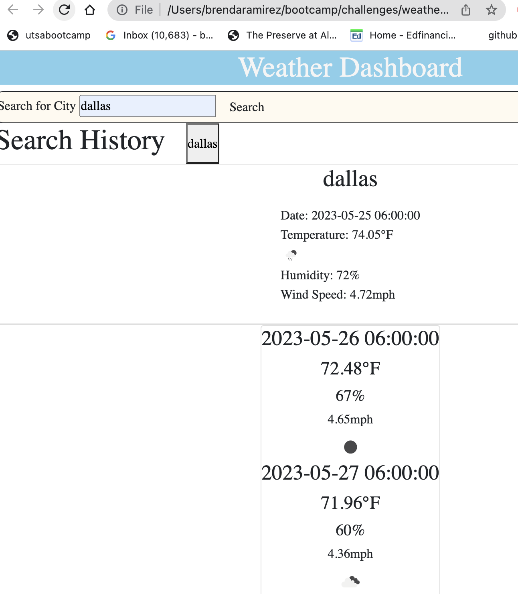

# weatherdashboard

## Description

The following weather dashboard application will display a 5 day forecast that include details such as a city, date, temperature and temperature icon depiction, humidity percentage and wind speed.

## Visuals

## Installation

Additional program installation is not required, please follow github link: 
https://bramirez09.github.io/weatherdashboard/

## Usage

The weather dashboard can be used to display the future 5 day forecast for a valid city from the open weather api. 

## Roadmap

There is additional features I would like to add to the weather dashboard but due to the limited free api's available on the open weather website , features were constricted. 